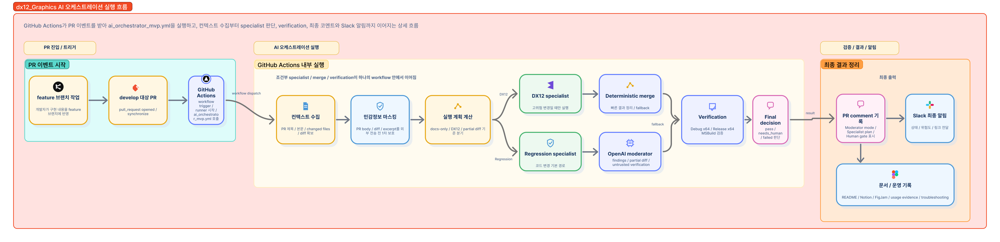
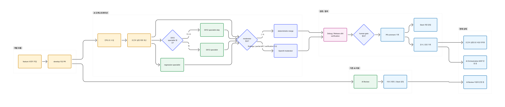

# dx12_Graphics

`dx12_Graphics`는 `dx12Engine` 프로젝트를 중심으로 구성한 DirectX 12 기반 그래픽스 작업 공간입니다.

지금 저장소는 단순한 엔진 초기화 실험에 그치지 않고, 아래 두 축을 함께 다루고 있습니다.

- DirectX 12 기반 엔진/테스트 작업 공간 정리
- GitHub Actions 기반 AI 코드 리뷰와 AI 오케스트레이션 자동화

## 현재 상황

- `dx12Engine` 솔루션을 기준으로 엔진 작업 공간을 유지하고 있습니다.
- 기존 `AI Review` workflow가 PR 기준으로 동작합니다.
- 별도 `AI Orchestration MVP` workflow가 병행 실행됩니다.
- 조건부 specialist / moderator 실행을 도입해 오케스트레이션 비용을 최적화했습니다.
- 성공 run 기준 오케스트레이션 비용은 약 `$0.03` 수준이며, 기존 `$0.07 ~ $0.08` 대비 크게 낮아졌습니다.
- 기본 브랜치 흐름은 `feature/* -> develop -> main` 입니다.

| 항목 | 상태 |
| --- | --- |
| DX12 엔진 작업 공간 | 진행 중 |
| AI Review 자동화 | 운영 중 |
| AI Orchestration MVP | 운영 중 |
| 조건부 실행 비용 최적화 | 적용 완료 |
| Slack 알림 | 운영 중 |
| 대표 검증 기준 | PR / Build / Comment / Slack |

## 기술 스택 / 운영 구성

### 실행 흐름 전체 요약


| 영역 | 사용 기술 / 도구 | 역할 |
| --- | --- | --- |
| 엔진 / 그래픽스 | `DirectX 12`, `C++`, `Visual Studio` | DX12 기반 엔진 작업 공간 |
| 빌드 / 검증 | `MSBuild`, `windows-latest`, `Debug x64`, `Release x64` | PR 기준 빌드 검증 |
| 리뷰 자동화 | `GitHub Actions`, `PowerShell` | AI 리뷰 / 오케스트레이션 workflow 실행 |
| AI 리뷰 | `OpenAI Responses API`, `gpt-5.4-mini` | PR diff 기반 리뷰와 specialist / moderator 판단 |
| 협업 / 알림 | `GitHub PR comment`, `Slack Webhook` | 리뷰 결과 기록과 최종 알림 |
| 문서 / 설계 | `README`, `docs/*`, `Notion`, `FigJam` | 설계 이유, 운영 기록, 시각 구조 정리 |

### 전체 요약

- `feature/* -> develop -> main` 브랜치 흐름 위에서 리뷰 자동화를 운영합니다.
- `AI Review`는 빠른 1차 리뷰를 담당합니다.
- `AI Orchestration MVP`는 context 수집, 조건부 specialist 실행, moderator merge, verification gate를 담당합니다.
- `Slack`은 최종 상태와 예외 상황을 전달합니다.
- `Notion / FigJam / README`는 설계와 운영 기록을 남기는 축으로 사용합니다.

## AI 작업 구조

현재 AI 작업 구조는 `기존 AI 리뷰`와 `조건부 AI 오케스트레이션`이 함께 동작하는 형태입니다.

- 기존 AI Review는 빠른 1차 리뷰와 Slack 알림 역할을 담당합니다.
- AI Orchestration은 context 수집, 조건부 실행 계획, specialist review, moderator merge, verification gate를 담당합니다.
- partial diff나 verification 이상 상황에서는 비용 절감보다 안전성을 우선합니다.

## 설계



- FigJam 구조도: [dx12_Graphics AI 작업 구조 전체 흐름](https://www.figma.com/board/2N1pKMPbwboAngw6wIbGxO?utm_source=other&utm_content=edit_in_figjam&oai_id=&request_id=a2a233f1-fd0c-447c-a612-3fdaa920f3da)
- 핵심 흐름
  - `feature` 작업 후 `develop` 대상 PR 생성
  - 기존 `AI Review`와 `AI Orchestration` 병행 실행
  - 오케스트레이션은 변경 범위에 따라 specialist / moderator 호출을 조절
  - verification 결과와 함께 PR comment, Slack, 운영 기록으로 결과 정리

## 저장소 구조

```text
dx12_Graphics/
├─ dx12Engine/
│  └─ dx12Engine/
├─ docs/
│  ├─ architecture.md
│  ├─ coding-standard.md
│  ├─ commit-message.md
│  ├─ review-rules.md
│  ├─ testing-strategy.md
│  ├─ ai-collaboration-workflow.md
│  ├─ ai-review-workflow.md
│  ├─ ai-review-troubleshooting.md
│  └─ ai-usage-evidence.md
├─ .github/
│  ├─ workflows/
│  │  ├─ ai_review.yml
│  │  └─ ai_orchestrator_mvp.yml
│  ├─ scripts/
│  │  ├─ collect_review_context.ps1
│  │  ├─ invoke_ai_review.ps1
│  │  ├─ invoke_specialist_review.ps1
│  │  ├─ merge_review_findings.ps1
│  │  ├─ run_verification.ps1
│  │  ├─ send_slack_review.ps1
│  │  └─ send_slack_orchestration.ps1
│  └─ pull_request_template.md
└─ README.md
```

## 관련 문서

- [Architecture](docs/architecture.md)
- [Coding Standard](docs/coding-standard.md)
- [Commit Message Guide](docs/commit-message.md)
- [Review Rules](docs/review-rules.md)
- [Testing Strategy](docs/testing-strategy.md)
- [AI Collaboration Workflow](docs/ai-collaboration-workflow.md)
- [AI Review Workflow](docs/ai-review-workflow.md)
- [AI Review Troubleshooting](docs/ai-review-troubleshooting.md)
- [Security and Secrets](docs/security-and-secrets.md)
- [AI Usage Evidence](docs/ai-usage-evidence.md)
- [Contributing](CONTRIBUTING.md)

## 현재까지 정리된 AI 방향

### 1. 기존 AI Review

- 변경 diff를 기반으로 빠르게 1차 리뷰를 수행합니다.
- PR comment와 Slack 알림으로 결과를 남깁니다.
- 비교적 짧은 실행 시간과 단순한 흐름이 장점입니다.

### 2. AI Orchestration MVP

- context 수집
- 조건부 실행 계획 계산
- DX12 specialist / regression specialist 실행
- OpenAI moderator 또는 deterministic merge
- Debug / Release x64 verification
- PR comment / Slack / 운영 기록 정리

### 3. 조건부 실행 비용 최적화

- 모든 PR에서 모든 specialist와 moderator를 항상 호출하지 않습니다.
- 변경 성격에 따라 DX12 specialist를 skip할 수 있습니다.
- findings, verification 이상, partial diff가 있을 때만 moderator를 적극 호출합니다.
- 성공 run 기준 비용은 약 `$0.03` 수준까지 낮아졌습니다.

## 다음 초점

- representative PR 유형별 검증 케이스 축적
- human gate 판단 기준 정리
- DX12 / mesh shader 작업 재개
- AI 오케스트레이션 운영 기준 고도화
