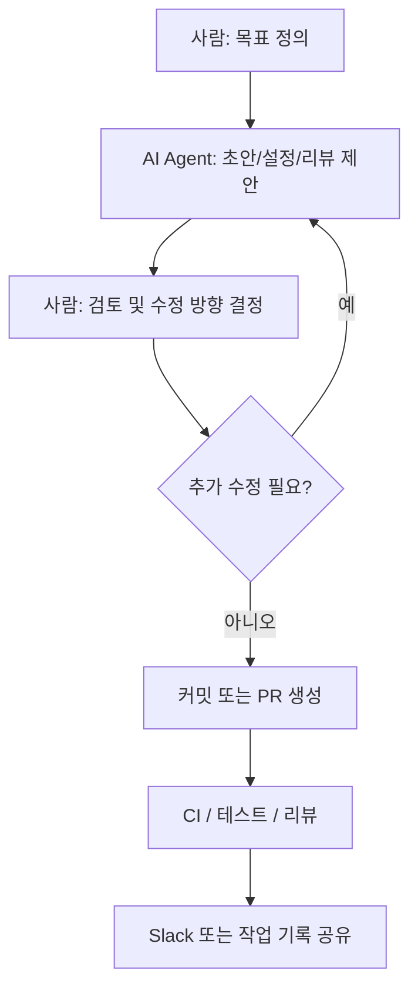
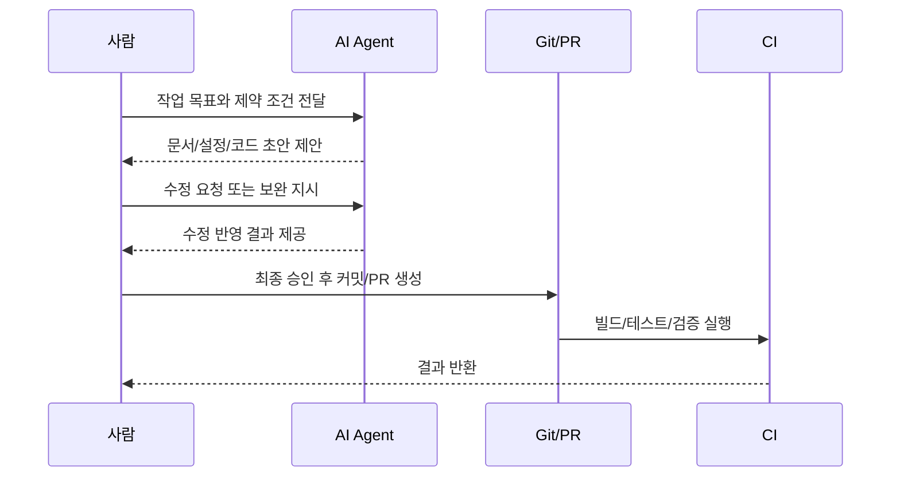

# AI Collaboration Workflow

## 목적

이 문서는 `dx12_Graphics` 저장소에서 AI Agent를 어떤 방식으로 작업 흐름에 포함시키는지 정리합니다.
핵심은 AI가 모든 것을 대신하는 것이 아니라, 사람이 목표와 판단을 담당하고 AI가 초안 작성, 반복 작업, 리뷰 보조를 맡는 구조를 명확히 하는 것입니다.

## 역할 분담

### 사람

- 작업 목표와 범위를 정의합니다.
- AI에게 필요한 입력과 제약 조건을 전달합니다.
- AI가 제안한 결과를 검토하고 최종 결정을 내립니다.
- 커밋, 머지, 방향 수정 같은 최종 책임을 가집니다.

### AI Agent

- 문서 초안 작성
- 설정 파일 초안 작성
- 코드 리뷰 기준 정리
- 반복 작업 자동화 보조
- 변경 사항 요약 및 회고 정리

### CI Or Automation

- 빌드, 테스트, 리뷰 보조 결과를 반복 실행합니다.
- AI 결과와 별개로 기계적 검증을 담당합니다.
- 향후 Slack 알림과 연결될 수 있습니다.

## 언제 AI를 사용하는가

- 새 문서나 정책 초안이 필요할 때
- 코딩 규칙, 리뷰 규칙, 테스트 전략을 정리할 때
- PR 설명, TIL, 변경 요약이 필요할 때
- 반복적인 설정 파일 작성이 필요할 때
- 코드 리뷰에서 빠진 관점을 보조로 확인하고 싶을 때

## 언제 사람이 직접 판단해야 하는가

- 아키텍처 방향을 최종 확정할 때
- DX12 리소스 수명과 동기화 정책을 결정할 때
- AI 제안이 프로젝트 방향과 맞는지 평가할 때
- 커밋, 머지, 배포 여부를 결정할 때

## 작업 흐름

1. 사람이 목표와 제약 조건을 정리합니다.
2. AI에게 원하는 결과물과 범위를 지시합니다.
3. AI가 초안, 코드, 문서, 설정 파일을 제안합니다.
4. 사람이 제안 내용을 검토하고 수정 방향을 결정합니다.
5. 필요하면 AI에게 추가 수정이나 확장을 요청합니다.
6. 최종 결과는 사람이 승인하고 커밋 또는 PR로 남깁니다.

## 프롬프트 작성 원칙

- 무엇을 만들지 명확하게 적습니다.
- 지금 해도 되는 일과 아직 하면 안 되는 일을 분리합니다.
- 결과 형식을 지정합니다.
- 검토 기준이 있다면 함께 적습니다.
- 변경 범위를 파일 또는 기능 기준으로 좁힙니다.

## 프롬프트 예시

### 문서 작업

- `README는 한국어로 정리하되 기술 용어는 필요 시 영어를 유지해줘`
- `코딩 규칙 문서를 만들되 if 조건과 nullptr 비교 규칙을 포함해줘`

### 설정 작업

- `.editorconfig`, `.clang-format`, `.clang-tidy`를 현재 문서 규칙에 맞춰 생성해줘
- `실제 코드는 만들지 말고 설정 파일 초안만 작성해줘`

### 리뷰 작업

- `이 변경에서 DX12 리소스 수명, fence, state transition 중심으로 리뷰해줘`
- `스타일보다는 회귀 가능성과 테스트 누락을 우선으로 봐줘`

## 워크플로우 다이어그램

## 리뷰 흐름 다이어그램

## 운영 원칙

- AI는 보조 도구이며 최종 책임자는 사람입니다.
- AI가 만든 결과는 반드시 사람이 읽고 승인합니다.
- 규칙은 문서와 도구 설정으로 함께 관리합니다.
- 중요한 결정은 커밋, PR, TIL, 문서 업데이트로 남깁니다.
