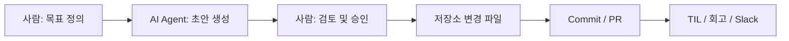

# AI Usage Evidence

## 목적

이 문서는 `dx12_Graphics` 저장소에서 "AI Agent를 사용하여 작업했다"는 사실을 어떤 방식으로 남기고 설명할 수 있는지 정리합니다.
중요한 점은 AI가 결과물을 만들었다는 사실만이 아니라, 사람이 AI를 작업 프로세스에 어떻게 포함시켰는지를 기록하는 것입니다.

## 무엇이 증빙이 되는가

아래 항목들은 모두 AI 활용의 증빙 자료가 될 수 있습니다.

- AI와 협업해서 만든 문서 초안
- AI가 작성한 설정 파일 또는 코드 초안
- 커밋 이력과 변경 파일
- PR 설명과 리뷰 기록
- TIL 또는 작업 회고
- CI 실행 결과
- Slack 알림 또는 작업 공유 기록

## 핵심 설명 방식

증빙을 설명할 때는 아래 세 가지를 함께 남기는 것이 좋습니다.

1. 사람은 무엇을 지시했는가
2. AI는 어떤 결과를 제안했는가
3. 사람은 무엇을 검토하고 승인했는가

즉, `AI가 대신했다`가 아니라 `사람이 AI를 워크플로우에 포함시켜 결과를 만들었다`는 형태로 남깁니다.

## 권장 증빙 묶음

### 최소 묶음

- 작업 목적이 적힌 TIL 또는 작업 메모
- 변경 결과가 보이는 커밋
- 변경된 문서 또는 설정 파일

### 권장 묶음

- 작업 목적
- AI에게 준 지시 또는 프롬프트 요약
- 결과물 파일
- 검토 기준
- 최종 커밋 또는 PR
- 회고 또는 변경 요약

## 어디에 남길 것인가

### TIL

- 어떤 작업을 왜 AI와 함께 진행했는지 정리합니다.
- 오늘 한 일, 느낀 점, 다음 할 일 형태로 정리하면 좋습니다.

### Commit

- 실제 결과물을 저장소 이력으로 남깁니다.
- 문서, 설정 파일, 템플릿 추가 같은 작업은 좋은 증빙이 됩니다.

### PR Description

- 변경 목적
- AI 사용 범위
- 테스트 방법
- 사람이 확인한 항목

### Review Or Slack

- 리뷰 결과 요약이나 빌드 상태를 공유한 흔적도 증빙이 됩니다.

## 예시 문장

### TIL 예시

- `AI Agent를 사용해 README와 코딩 규칙 문서 초안을 작성하고, 사람이 검토 후 저장소에 반영했다.`
- `AI Agent가 .clang-format과 .clang-tidy 초안을 제안했고, 프로젝트 방향에 맞춰 사람이 검토했다.`

### PR 예시

- `본 PR은 AI Agent를 사용해 문서 및 설정 파일 초안을 만든 뒤, 사람이 검토 및 수정하여 반영한 변경입니다.`

## 증빙 흐름 다이어그램

## 실무 팁

- 결과물만 남기지 말고 작업 의도도 함께 남깁니다.
- AI가 한 일과 사람이 한 일을 구분해서 씁니다.
- 중요한 변경은 TIL, 커밋, PR 중 최소 두 군데 이상에 흔적을 남깁니다.
- 반복적으로 사용할 수 있는 워크플로우는 별도 문서로 정리합니다.
