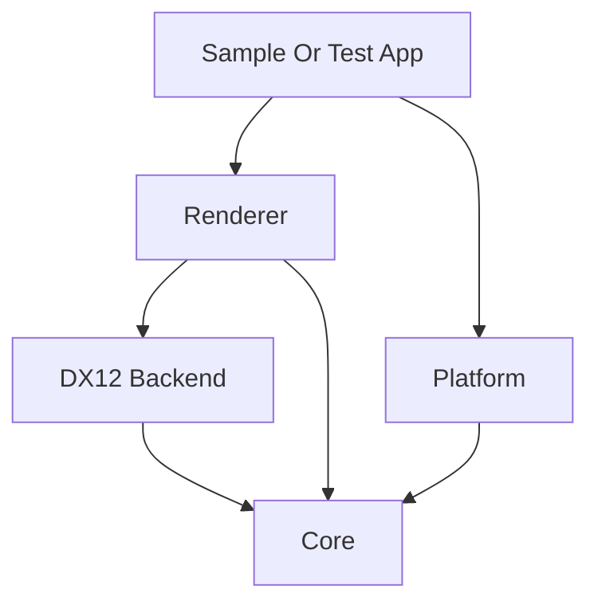

# Architecture

## 목적

이 문서는 `dx12Engine` 프로젝트의 구조 방향과 책임 분리 원칙을 정리합니다.
현재 프로젝트는 초기 단계이므로, 이 문서는 최종 설계서가 아니라 앞으로의 구현 기준이 되는 구조 초안입니다.

## 아키텍처 목표

- DirectX 12 기반 렌더링 기능을 단계적으로 확장할 수 있는 구조를 만듭니다.
- 엔진 코어와 플랫폼 의존 영역, 렌더링 백엔드의 책임을 분리합니다.
- 테스트와 샘플 코드를 통해 기능 검증이 가능한 구조를 지향합니다.
- AI 리뷰와 사람 리뷰가 모두 이해하기 쉬운 명확한 계층을 유지합니다.

## 구조 다이어그램

## 권장 레이어

프로젝트는 아래와 같은 계층 구조를 기본 방향으로 삼습니다.

### Core

- 공통 유틸리티
- 메모리 및 리소스 수명 관리 보조 기능
- 시간, 로그, assert, 공통 타입

### Platform

- 윈도우 생성 및 메시지 처리
- 입력 처리
- OS 의존 초기화 코드

### Renderer

- 렌더링 흐름 제어
- 프레임 단위 작업 관리
- 렌더 패스 또는 렌더링 단계 구성

### DX12 Backend

- Device, Swap Chain, Command Queue, Command List 관리
- Descriptor Heap 관리
- Fence와 동기화 처리
- Resource State 전이 처리

### Sample Or Test App

- 엔진 API 사용 예시
- 렌더링 결과 확인용 실행 코드
- 기능 검증 및 회귀 확인용 테스트 환경

## 의존성 원칙

- `Core`는 가능한 한 다른 레이어에 의존하지 않습니다.
- `Platform`은 OS 의존 코드를 담당하지만 렌더링 세부 구현을 직접 포함하지 않습니다.
- `Renderer`는 렌더링 흐름을 관리하지만 플랫폼 처리와 직접 결합하지 않습니다.
- `DX12 Backend`는 DirectX 12 API 세부 구현을 담당합니다.
- `Sample Or Test App`은 엔진을 사용하는 쪽이며, 엔진 내부 세부 사항에 과도하게 의존하지 않도록 합니다.

## 구조 설계 원칙

- 한 모듈은 가능한 한 하나의 책임에 집중합니다.
- 리소스 생성, 소유권, 해제 책임은 타입 경계에서 명확해야 합니다.
- 프레임 단위 객체와 장기 수명 객체를 구분합니다.
- DirectX 12 관련 저수준 처리와 엔진 레벨 흐름 제어를 분리합니다.
- 테스트 코드가 엔진 구조를 무너뜨리지 않도록 별도 경계를 유지합니다.

## 폴더 구조 초안

구현이 진행되면 아래와 같은 구성을 우선 검토합니다.

- `dx12Engine/Core`
- `dx12Engine/Platform`
- `dx12Engine/Renderer`
- `dx12Engine/DX12`
- `dx12Engine/Samples`
- `dx12Engine/Tests`

## 향후 결정 예정 항목

- Render Pass 또는 Render Graph 도입 여부
- 리소스 래퍼 수준과 범위
- 로그 시스템 및 assertion 정책
- 테스트 프로젝트 분리 방식
- 샘플 실행 파일과 엔진 라이브러리 분리 여부
